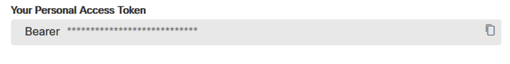
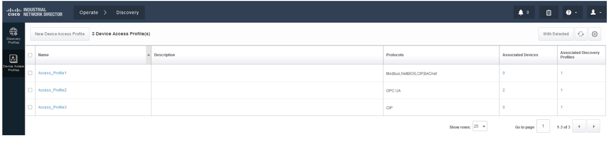
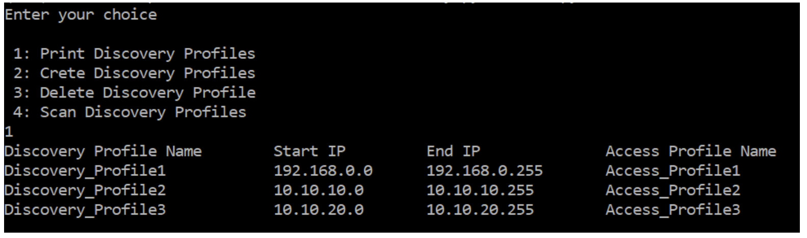
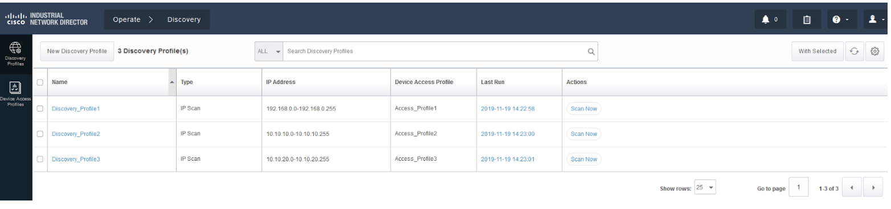
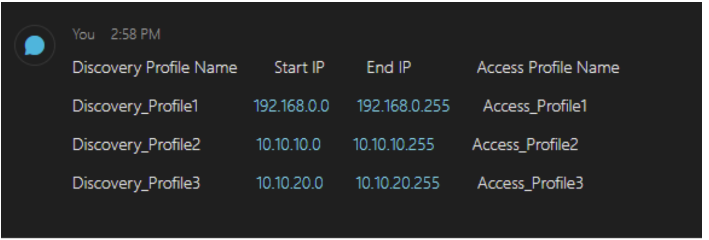

# Cisco APO Use Case Runbook

## Technology: IoT

## Level: Walk

## Name: **IND: Automated Asset Discovery_ -[ https://developer.cisco.com/codeexchange/github/repo/vpralhad/IND-Discovery-Profile-Python](https://github.com/sttrayno/IND-Ansible-Discovery) _**

**Scenario: **Commercial Account seeks to automate the deployment of manufacturing machines by creating Python scripts to automate the discovery in their IND system so the manufacturer can discover their devices using multiple protocols. This code allows protocols such as Modbus, BACnet Ethernet/IP, Profinet and OPC-UA to be added programatically to their IND controller. In addition, using the Automation scripts they can push the output to a WebEx teams space to share the discovery output.

**Customer Story:** Customer F has 250 discrete manufacturing control points in their factory.  Discreet machine controllers speak a multitude of different protocols based on the choice of that machine manufacturer.  To manually discover each protocol across a wide range of network space and multiple subnets requires **nearly 24 hours of configuration time to define and run the discovery**. After the customer implemented Automated Asset Discovery, they can let the systems run unattended and discover each machine across multiple protocol types with **just 10 minutes of set up, reducing the configuration time by 99%.**

**Partner Story:**  VAR Partner F taught their deployment engineers to use the Python scripts and was able to reduce the time to discover the end devices in the customers manufacturing facility, reduce configuration errors, and document how the system was deployed, increasing the services margin on the deal.**_ _**

**Code Exchange Link:** [https://developer.cisco.com/codeexchange/github/repo/vpralhad/IND-Discovery-Profile-Python](https://developer.cisco.com/codeexchange/github/repo/vpralhad/IND-Discovery-Profile-Python)

## Objectives

Create, Scan, Print and Delete the IND (Industrial Network Director) Discovery Profiles using Python.

## **Use Case Playbook**

Pre-requisites -

You will need a Webex Teams account to complete this Playbook in its entirety. With this account, you will also need to generate a token for your scripts. Details can be found at: [https://developer.webex.com/docs/api/getting-started](https://developer.webex.com/docs/api/getting-started).

These scripts were developed under Python version 3.6.5 , but should work with version 3.5+. Dependencies are contained in the “requirements.txt’ file that is included in the repo. A copy of Cisco Industrial Network Director is required or by installing IND 1.7.1 on local computer ([https://software.cisco.com/download/home/286310815/type/286310951/release/1.7.1](https://software.cisco.com/download/home/286310815/type/286310951/release/1.7.1)). In addition, an Access Profile must be created in IND prior to running the scripts.

## **Cisco Industrial Network Director -**

The Cisco Industrial Network Director is an easy-to-adopt network management system for industrial automation. It is specifically designed to help operations teams manage automation by providing full visibility and control of the Industrial Ethernet infrastructure in the context of the automation process. For information, please visit [https://www.cisco.com/c/en/us/products/cloud-systems-management/industrial-network-director/index.html](https://www.cisco.com/c/en/us/products/cloud-systems-management/industrial-network-director/index.html)

## 
**Script Summary -**

The goal of the python script is create, print, delete and scan the discovery profiles and output the result in command prompt as well as in WebEx Teams room.

## 
**Detailed Steps -**

When you clone the repo, it includes following files -

*   “env_lab.py” which is where the IND details are defined, including credentials for logging in
*   “env_user.py” which needs to be updated with your WebEx Teams user token and room ID 
*   “devices.csv”  which contains the discovery profile fields
*   There is one more file called “JasonRecords.json” which will be created when you run “discovery.py”
*   “discovery.py” contains the script we will run

Run following commands on your computer (in this case, Windows machine is used so)

    1. git clone [https://github.com/vpralhad/IND-Discovery-Profile-Python](https://github.com/vpralhad/IND-Discovery-Profile-Python)
    2. cd IND-Discovery-Profile-Python
    3. python -m venv venv
    4. pip install requirements.txt

WebEx Teams -

    1. Create a room in WebEx Teams
    2. Add RoomID bot to the room which will create a room id to use in env_user.py (var name SPARK_ROOM_ID)
    3. go to [https://developer.webex.com/](https://developer.webex.com/)
    4. Make sure you are logged in click on Documentation on top and go to Getting Started page
    5. By scrolling further down, copy the Bearer token (valid for 12 hours) and paste it to env_user.py file (var name - SPARK_ACCESS_TOKEN)

>>>>>  gd2md-html alert: inline image link here (to images/Cisco-APO0.png). Store image on your image server and adjust path/filename if necessary.  (<a href="#">Back to top</a>)(<a href="#gdcalert2">Next alert</a>) >>>>> 

Create Access Profile in IND-

From the IND web page, go to Operate-->Discovery-->Device Access Profiles-->New Device Access Profiles (in this case, create the 3 access profiles seen below) \
**Sample Output - \
**

>>>>>  gd2md-html alert: inline image link here (to images/Cisco-APO1.png). Store image on your image server and adjust path/filename if necessary.  (<a href="#">Back to top</a>)(<a href="#gdcalert3">Next alert</a>) >>>>> 

Running the script -

    Run "python discovery.py" (Enter 1 for printing discovery profiles, 2 for creating, 3 for deleting and 4 for scanning the profiles)

**Sample output - \
**

>>>>>  gd2md-html alert: inline image link here (to images/Cisco-APO2.png). Store image on your image server and adjust path/filename if necessary.  (<a href="#">Back to top</a>)(<a href="#gdcalert4">Next alert</a>) >>>>> 

Check if the discovery profiles were created by logging into the IND dashboard (https://localhost:8443)-->Operate-->Discovery-->Discovery profiles

**Sample output - \
**

>>>>>  gd2md-html alert: inline image link here (to images/Cisco-APO3.png). Store image on your image server and adjust path/filename if necessary.  (<a href="#">Back to top</a>)(<a href="#gdcalert5">Next alert</a>) >>>>> 

 Check the WebEx Teams where you created the room. It should have the same output as you got in command prompt. \

**Sample output - \
**

>>>>>  gd2md-html alert: inline image link here (to images/Cisco-APO4.png). Store image on your image server and adjust path/filename if necessary.  (<a href="#">Back to top</a>)(<a href="#gdcalert6">Next alert</a>) >>>>> 

Once you complete the Learning labs you will be ready for the challenge.

## Completion Challenge

In order to provide a Proof of Performance Challenge we are going to set the following goal. Take what you have learned in the labs and develop a second script that creates Access Profiles instead of Discovery Profiles by copying the files to another directory and modifying them using the “_access-profiles” _API calls instead of the “_discover-profiles_” API calls. For detailed API information and examples see the API Tool from the help portion of the IND Web pages. A great tool to manually test your API calls is Postman ([getpostman.com](https://www.getpostman.com/)). 

Once you have completed the challenge, please host a 2 minute demo of your application running and send the link to {{ [email_addr@cisco.com](mailto:email_addr@cisco.com) }} where your video will be reviewed for credit. We suggest doing a Webex demo and recording it. Share the recording link via the email for review.

